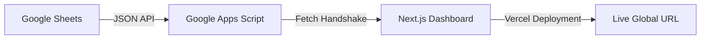

# 💎 VAULT.LOG | Personal Financial Intelligence

[](https://nextjs.org/)
[](https://developers.google.com/apps-script)
[](https://tailwindcss.com/)
[](https://vercel.com/)

> **A premium, high-performance financial dashboard that bridges the gap between Google Sheets and Modern Web UI.**

---

## ⚡ Overview

**Vault.log** is more than just a finance tracker; it is a custom-engineered **Financial Staging Environment**. Designed with a **Software QA mindset**, it transforms raw Google Sheets data into a high-fidelity, interactive dashboard.

Built specifically for tracking a **24-month savings journey** (Project: Capital Pulse), this tool ensures data integrity, real-time metric visualization, and fiscal intelligence.

### 🛠 Core Tech Stack

- **Frontend:** Next.js (App Router) + Tailwind CSS
- **Backend:** Google Apps Script (REST API)
- **Database:** Google Sheets (Dynamic Engine)
- **Deployment:** Vercel

---

## 🚀 Key Features

- **📡 Real-Time Data Handshake:** Instant synchronization between Spreadsheet entries and the Web UI.
- **🧠 Financial Intelligence Banner:** Dynamic status alerts (Critical, Excellent, On Track) based on automated savings-rate logic.
- **📅 Weekly Activity Tracker:** A GitHub-style heat map visualizing transaction density and daily flow.
- **💼 Multi-Account Monitoring:** High-level overview of Liquid Cash, Fixed Deposits, DPS, and Net Worth.
- **🌗 Minimalist Dark Aesthetic:** Optimized for high-end workspace environments (MacBook Pro / Dual Dell Setup).

---

## 🏗 System Architecture



---

## 🛠️ Installation & Setup

1. Clone the repository

```bash
git clone [https://github.com/your-username/jubu-finance.git](https://github.com/your-username/jubu-finance.git)
```

2. Install dependencies

```bash
npm install
```

3. Configure API
   `Update the API_URL in app/page.tsx with your Google Apps Script Deployment URL.`
4. Run local environments

```
npm run dev
```

---

## 👔 Let’s Build Your Vault

While this specific instance is built for my personal **"Capital Pulse"** collective, I specialize in building **Custom Data Bridges**.

> **Are you looking for a similar automated dashboard?** > I can transform your complex Google Sheets or Excel data into a professional, mobile-responsive web dashboard tailored to your needs.

### What I Offer:

- 🚀 **Automation:** Stop looking at boring rows; start looking at actionable insights.
- 🧠 **Custom Logic:** Tailored alerts, predictive graphs, and complex tracking metrics.
- 🎨 **Modern Design:** Minimalist UI built for clarity, precision, and speed.
- 📱 **Mobile First:** Access your data anywhere, optimized for all devices.

---

## About the QA

# Jubair Rahman

**Software Engineer (QA) | HealthTech | Passionate about testing, tools, and UI quality.**

[](https://www.linkedin.com/in/jubair-rahman/) [](https://github.com/JubairRahman) [](https://wa.me/8801645763353)

---

_Generated with precision. Quality Assured._
